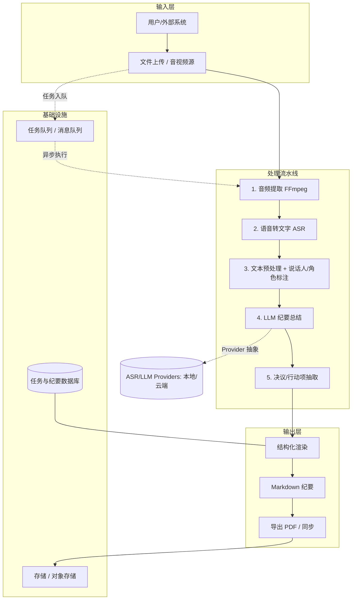
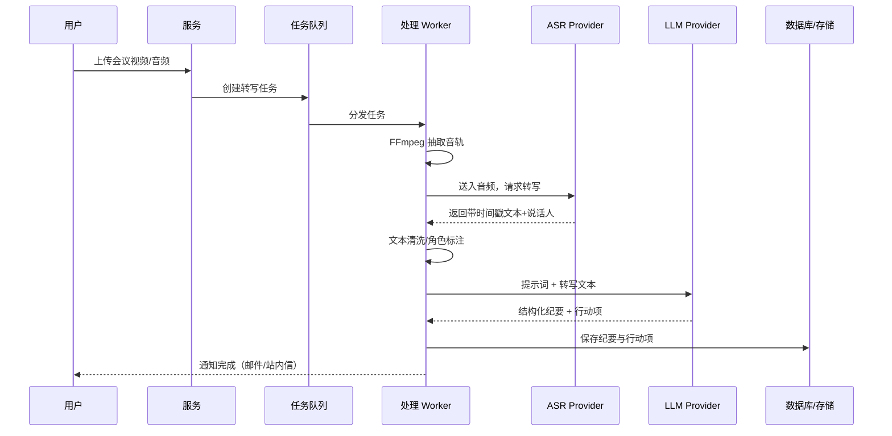
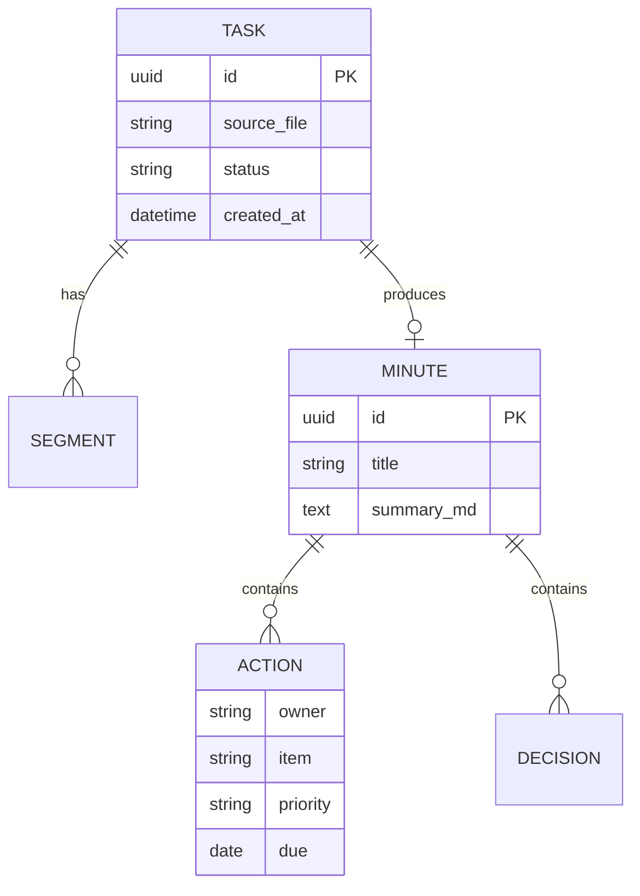

# 会议纪要助手 · 项目总章程与软件设计文档

> **Project Charter & Software Design Document (SDD)**
>
> 围绕「会议视频 → 语音 → 文字 → 结构化会议纪要」的完整链路进行总体规划与软件设计。

| 文档信息 | 内容 |
| --- | --- |
| 项目代号 | Meeting Minutes Assistant（会议纪要助手） |
| 文档类型 | 项目总章程 + 软件设计文档（SDD） |
| 版本 | v0.1（草案） |
| 状态 | 🏗️ 规划阶段 / 待评审 |
| 创建日期 | 2026-08-23 |
| 负责人 | Lancer-Go |
| 仓库 | `github.com/Lancer-Go/Meeting-Minutes-Assistant` |

> ⚠️ **阅读说明**：本文档将项目"总章程"（目标、范围、干系人、里程碑）与"软件开发设计"（需求、架构、技术方案、接口、测试）合二为一。当前项目处于 **早期规划阶段**，文中标注 🔶【建议】的内容为技术选型候选方案，标注 ❓【待确认】的内容需业务侧补充确认，标注 ✅【已定】的内容为已决约束。

---

## 目录

1. [项目章程 (Project Charter)](#1-项目章程-project-charter)
2. [需求分析 (Requirements)](#2-需求分析-requirements)
3. [总体架构 (Architecture)](#3-总体架构-architecture)
4. [关键技术方案 (Key Technical Solutions)](#4-关键技术方案-key-technical-solutions)
5. [数据与接口设计 (Data & Interface Design)](#5-数据与接口设计-data--interface-design)
6. [测试策略 (Testing Strategy)](#6-测试策略-testing-strategy)
7. [部署与运维 (Deployment & Ops)](#7-部署与运维-deployment--ops)
8. [路线图与里程碑 (Roadmap)](#8-路线图与里程碑-roadmap)
9. [风险与应对 (Risks)](#9-风险与应对-risks)
10. [待确认项 (Open Questions)](#10-待确认项-open-questions)
11. [附录 (Appendix)](#11-附录-appendix)

---

## 1. 项目章程 (Project Charter)

### 1.1 项目背景

日常会议（线上腾讯会议 / Zoom / Teams、线下录音录像）时长不一、讨论发散，参会者往往只凭记忆整理纪要，导致：

- **遗漏关键决议**：讨论半天，散会即忘。
- **行动项无法闭环**：谁负责、什么时间做完，缺少追踪。
- **人工整理耗时**：一场 1 小时的会议，人工整理纪要约需 30–60 分钟。
- **信息难检索**：历史会议内容散落在聊天记录、录音文件里，无法低成本回查。

本项目的目标，是构建一个"**开会 → 自动出纪要**"的助手：输入一段会议视频/音频，自动完成语音转写、内容整理、结构化纪要生成与行动项提取。

### 1.2 项目愿景与目标

> **一句话愿景**：让每一场会议都"散会即成文"。

**核心目标（✅ 已定）**

- G1：支持输入会议视频 / 音频文件，自动提取音频并转写为文字。
- G2：对转写文本进行内容梳理与总结，生成结构化会议纪要。
- G3：从纪要中自动提取**决议、行动项、负责人、截止时间**，形成可追踪的任务清单。
- G4：产出标准化的 Markdown 纪要文件，便于归档与二次使用。

**扩展目标（🔶 建议，后期）**

- G5：多会议历史检索与智能问答。
- G6：与日历 / 待办 / IM 工具对接，将行动项自动同步为任务。
- G7：支持实时会议转写（边开边转）。

### 1.3 项目范围

**范围内 (In Scope)**

- 会议视频 / 音频文件的上传与预处理。
- 音视频 → 文本转写（说话人区分）。
- 文本总结与结构化纪要生成（LLM）。
- 纪要的 Markdown / PDF 导出。
- 单机（本地）/ 云端服务两种形态（🔶 建议）。

**范围外 (Out of Scope) — v1**

- ❌ 实时直播流转写（G7，放到后期）。
- ❌ 多人会议的视频画面分析（人脸识别、肢体语言等）。
- ❌ 会议室硬件集成。
- ❌ 跨组织协作的高级权限体系。

### 1.4 干系人 (Stakeholders)

| 角色 | 关注点 |
| --- | --- |
| **产品 / 项目发起人** | 清晰的产品定位、成本可控、可规模化 |
| **研发团队** | 架构清晰、技术选型可行、可维护 |
| **最终用户（参会者）** | 纪要准确、操作简单、输出即用 |
| **管理者 / 团队负责人** | 行动项闭环、效率提升、合规与数据安全 |
| **运维 / 数据安全** | 隐私合规、部署稳定性、日志审计 |

### 1.5 关键约束与假设

| 类别 | 约束 / 假设 |
| --- | --- |
| 数据来源 | 会议录像/录音；视频格式以 MP4 / MKV 为主，音频含 WAV / MP3 / M4A |
| 语言 | 首要支持中文（普通话），英文为扩展 ✅ |
| 计算资源 | 🔶【建议】ASR 优先采用云端 API 或较强算力；本地部署需 GPU |
| 数据隐私 | 会议内容敏感，需支持本地化部署与数据不出域 ❓【待确认】 |
| 成本预算 | 🔶【建议】按"云端 API 按量计费 / 本地开源模型零授权费"双模式对比 |

### 1.6 成功标准 (KPI)

| 指标 | 目标值（v1） | 说明 |
| --- | --- | --- |
| 转写准确率 (中文) | ≥ 92% (CER) | 含标点与大小写规则下的字符错误率 |
| 纪要生成耗时 | ≤ 会议时长的 1/3 | 1 小时会议 ≤ 20 分钟出稿 |
| 行动项提取准确率 | ≥ 85% | 决议 / 负责人 / 截止时间三要素完整性 |
| 人工返工率 | ≤ 20% | 出稿后需人工改动的比例 |
| 成本 | ≤ ¥1 / 场（云端模式） | 以典型 1 小时会议估算 |

---

## 2. 需求分析 (Requirements)

### 2.1 功能需求 (Functional Requirements)

按 **MoSCoW** 优先级划分：

**Must Have（必须有，v1）**

| 编号 | 需求 | 描述 | 优先级 |
| --- | --- | --- | --- |
| FR-01 | 文件上传 | 支持拖拽 / 选择会议视频或音频文件 | M |
| FR-02 | 音频提取 | 从视频中抽取音轨，支持格式与采样率标准化 | M |
| FR-03 | 语音转写 | 将音频转为带时间戳的文本，识别说话人 | M |
| FR-04 | 纪要生成 | 对转写文本进行结构化总结（LLM） | M |
| FR-05 | 行动项提取 | 从纪要中抽取决议、行动项、负责人、截止时间 | M |
| FR-06 | 输出导出 | 生成 Markdown 纪要，可导出 PDF | M |
| FR-07 | 任务状态 | 展示转写/总结进度与运行日志 | M |

**Should Have（应该有，v1.5）**

| 编号 | 需求 | 描述 |
| --- | --- | --- |
| FR-08 | 纪要模板 | 提供多种纪要模板（标准 / 精简 / 详细） |
| FR-09 | 编辑与批注 | 支持在纪要上人工修改、批注、确认 |
| FR-10 | 历史管理 | 按会议时间/主题检索过往纪要 |
| FR-11 | 说话人角色标注 | 识别并标注主持人、汇报人、与会者等角色 |

**Could Have（可以有，v2）**

| 编号 | 需求 | 描述 |
| --- | --- | --- |
| FR-12 | 多模型切换 | 支持切换不同 LLM / ASR 模型 |
| FR-13 | 摘要摘要播客 | 生成会后行动摘要邮件 / 播客稿 |
| FR-14 | 实时转写 | 会议进行中即转即出（G7） |

### 2.2 非功能需求 (Non-Functional Requirements)

| 维度 | 要求 |
| --- | --- |
| **性能** | 转写吞吐 ≥ 实时速率的 5 倍；纪要生成可并行 |
| **可用性** | 单任务失败可重试；系统在线率 ≥ 99%（云端模式） |
| **可扩展** | ASR / LLM 可插拔（Provider 抽象），便于换供应商 |
| **安全** | 数据加密存储（AES-256）、传输全程 TLS、访问鉴权 |
| **隐私合规** | 🔶【建议】默认支持"本地处理、数据不出域"，满足企业合规 |
| **可观测** | 标准结构化日志 + 指标（转写耗时、错误率、成本） |
| **可维护** | 模块化、单元测试覆盖率目标 ≥ 70% |

---

## 3. 总体架构 (Architecture)

### 3.1 架构视图

项目采用 **"管道式 (Pipeline) + 可插拔 Provider"** 的架构：一条清晰的处理流水线，ASR 与 LLM 通过抽象接口接入，可自由切换本地 / 云端实现，最大化灵活性与成本可控性。



### 3.2 系统数据流（核心链路）



### 3.3 模块划分与职责

| 模块 | 职责 | 关键技术 🔶建议 |
| --- | --- | --- |
| **ingestion** | 文件上传、格式校验、任务创建 | HTTP / S3 / 对象存储 |
| **audio** | 视频抽音轨、采样率/声道归一化、静音检测 | FFmpeg / pydub |
| **asr** | 语音转文本、说话人分离、时间戳 | Whisper / FunASR / 云API |
| **nlp** | 文本清洗、分段、角色识别、关键词 | spaCy / 规则 + LLM |
| **summary** | LLM 纪要生成、模板化 | DeepSeek / GPT / Qwen |
| **extractor** | 决议/行动项/负责人/截止时间抽取 | LLM Function-Call / JSON Schema |
| **render** | 纪要渲染为 Markdown / PDF | Markdown / Pandoc |
| **orchestrator** | 任务状态机、队列调度、重试 | Celery / 消息队列 |
| **storage** | 原始文件、中间产物、纪要持久化 | 对象存储 + 关系库 |

### 3.4 部署形态

🔶【建议】提供两种部署形态，前期以 **云端服务** 为主：

- **云端 SaaS**：API 网关 + 异步任务队列 + 可横向扩展的 Worker 集群，ASR/LLM 走云 API，成本按量。
- **私有化 / 本地**：面向保密需求，ASR/LLM 走开源模型（本地 IME/GPU），数据不出域。

---

## 4. 关键技术方案 (Key Technical Solutions)

本节是对「视频 → 语音 → 文字 → 纪要」每一环的选型分析与落地思路，是 SDD 的技术核心。

### 4.1 输入：会议视频 / 音频源

| 来源 | 常见格式 | 说明 |
| --- | --- | --- |
| 腾讯会议 / Zoom / Teams 录制 | MP4 / MP4A | 本地或云端录制文件 |
| 线下录音 | WAV / MP3 / M4A | 可能含噪音、远场拾音 |
| 视频链接（后期） | URL | 网络下载 / 直链解析 |

**要点**：输入需做格式白名单校验、大小限制、时长限制，并标注任务来源。

### 4.2 音频提取（FFmpeg）

从视频抽取音轨并标准化，保证下游 ASR 输入稳定：

```bash
# 抽取音轨 → 16kHz 单声道 WAV（ASR 常用规格）
ffmpeg -i input.mp4 -vn -ac 1 -ar 16000 -f wav output.wav
```

- 统一采样率（16kHz 大部分 ASR 友好）、单声道、去除封面/视频流（`-vn`）。
- 可选做**静音检测、降噪、AGC（自动增益）**，提升转写质量（尤其线下噪声录音）。

### 4.3 语音转文字（ASR）🔶建议

| 方案 | 类型 | 优点 | 缺点 | 适用 |
| --- | --- | --- | --- | --- |
| **Whisper (OpenAI) 本地版** | 开源 | 中英文强、可离线、免费 | 需 GPU / 慢 | 本地/私有化 |
| **FunASR (阿里开源自研)** | 开源 | 中文口语极佳、有说话人分离 | 生态相对小 | 中文会议 |
| **阿里云 / 讯飞 / 腾讯云 ASR** | 云API | 准确率高、省心、标点好 | 按量收费、数据出域 | 云端 SaaS |
| **Azure / Google / Openai whisper-api** | 云API | 多语言、部署省心 | 外资云、成本 | 对标外企 |

> **策略**：抽象出 `ASRProvider` 接口，v1 建议本地 **Whisper/faster-whisper**（离线、可控），生产测试后按需切换到云 API。

**说话人分离（Diarization）**：🔶建议使用 **pyannote / Faster-whisper di-art（whisperx）**，输出 `speaker_id + 时间戳 + 文本`。

### 4.4 文本预处理与角色标注

- 分句、去重复、合并被切碎的句子。
- 标记说话人（Speaker A/B…），可选基于上下文猜测角色（主持人/汇报人/参会者）。
- 生成带时间戳的对话结构，作为 LLM 输入。

### 4.5 LLM 纪要生成（Summarization）🔶建议

| 方案 | 特点 |
| --- | --- |
| **DeepSeek-V3 / R1** | 中文强、性价比高，🔶首选 |
| **GPT-4o / Claude** | 通用能力强，成本较高 |
| **Qwen (通义千问)** | 中文好、开源可本地化 |
| **GLM / Kimi** | 国产、长文本友好 |

**要点**：

- 采用**结构化输出**约束（`response_format` / Function-Calling / JSON Schema），保证纪要字段稳定。
- 长会议文本超上下文时，采用 **Map-Reduce / 分块总结 + 合并** 策略。
- 关键提示词（示例）：

```text
你是会议纪要助手。请对下面的会议转写内容生成结构化纪要，包含：
1) 会议主题与基本信息；2) 核心结论/决议；3) 讨论要点摘要；
4) 行动项清单（负责人、事项、优先级、截止时间）；5) 待跟进/未决问题。
输出为 Markdown。
```

### 4.6 纪要交付物与模板

默认输出 Markdown，标准模板结构（🔶建议）：

```markdown
# 会议纪要
- 会议主题：…
- 时间：…  时长：…  参会人：…

## 一、会议目标
## 二、核心决议
## 三、讨论要点
## 四、行动项
| 行动项 | 负责人 | 优先级 | 截止时间 | 状态 |
| --- | --- | --- | --- | --- |
## 五、未决问题 / 待跟进
## 六、附录（时间戳全文）
```

可导出为 **PDF / docx**（Pandoc / 模板渲染），并（后期）同步到日历 / 待办。

---

## 5. 数据与接口设计 (Data & Interface Design)

### 5.1 核心数据模型

**Task（转写任务）**

| 字段 | 类型 | 说明 |
| --- | --- | --- |
| id | uuid | 任务ID |
| source_file | string | 原始文件路径 |
| status | enum | pending/running/succeeded/failed |
| progress | float | 进度 0-1 |
| created_at / finished_at | datetime | 时间 |
| error | string | 失败原因 |

**Transcript（转写文本）**

| 字段 | 类型 | 说明 |
| --- | --- | --- |
| task_id | fk | 关联任务 |
| segments[] | list | 每段：start/end/speaker/text |

**Minute（纪要）**

| 字段 | 类型 | 说明 |
| --- | --- | --- |
| task_id | fk | 关联任务 |
| title | string | 会议主题 |
| summary_md | text | 纪要 Markdown |
| decisions[] | list | 决议 |
| actions[] | list | 行动项（owner/due/priority） |
| open_questions[] | list | 未决问题 |

### 5.2 领域关系（ER 简图）



### 5.3 API 接口约定（RESTful 建议）

| 方法 | 路径 | 说明 |
| --- | --- | --- |
| POST | `/api/tasks` | 上传文件并创建转写任务 |
| GET | `/api/tasks/{id}` | 查询任务状态与进度 |
| GET | `/api/tasks/{id}/transcript` | 获取转写文本 |
| GET | `/api/tasks/{id}/minute` | 获取生成的纪要 |
| POST | `/api/tasks/{id}/regen` | 重新生成（换模型/模板） |
| GET | `/api/minutes` | 纪要历史列表 / 搜索 |

---

## 6. 测试策略 (Testing Strategy)

| 层级 | 重点 | 手段 |
| --- | --- | --- |
| **单元测试** | 各模块纯逻辑、提示词解析、字段校验 | pytest / jest |
| **集成测试** | 音频→ASR→LLM 全链路 | 真实样例 + mock provider |
| **评测集 (Eval Set)** | 纪要质量、行动项准确率 | 人工标注黄金基准集 |
| **性能测试** | 大文件、长会议、高并发 | Locust / k6 |
| **安全测试** | 鉴权、越权、上传校验、模型注入 | OWASP 检查项 |

> **质量底线**：每个里程碑切换前，对固定 Eval 集跑一次，指标不达标不发版。

---

## 7. 部署与运维 (Deployment & Ops)

- **CI/CD**：GitHub Actions —— lint → test → build → 镜像发布。
- **容器化**：Docker Compose 本地一键起，K8s 用于云端集群。
- **运行环境**：
  - 云端：API + 队列 + Worker（可扩缩）；ASR 可走 GPU Node Pool。
  - 本地：Docker Compose + 本地模型，数据不出域。
- **可观测**：结构化日志（JSON）、指标（转写时长/错误率/成本）、告警。

---

## 8. 路线图与里程碑 (Roadmap)

| 阶段 | 交付物 | 预估周期 | 关键点 |
| --- | --- | --- | --- |
| **M0 概念验证 (PoC)** | FFmpeg 抽音 + Whisper 示例 + 一次 LLM 纪要 | 1–2 周 | 打通核心链路可行性质检 |
| **M1 MVP** | 上传→转写→纪要→导出 闭环、单机可用 | 3–4 周 | 满足 FR-01~07 |
| **M2 结构增强** | 行动项抽取、说话人角色、多种模板 | 3–4 周 | FR-08~11 |
| **M3 生产化** | 云端部署、扩展性、可观测、合规 | 4–6 周 | 满足 NFR |
| **M4 智能化** | 多模型、检索问答、日历/待办打通 | 后期 | FR-12~14, G5~G7 |

---

## 9. 风险与应对 (Risks)

| 风险 | 等级 | 应对 |
| --- | --- | --- |
| ASR 准确率不达标（方言/噪声） | 高 | 多模型对比、加降噪、预留人工校对 |
| LLM 生成幻觉/纪要漂移 | 高 | 结构化输出约束、提供全文附录、人工审查 |
| 成本不可控 | 中 | Provider 可插拔、本地开源降本、限额告警 |
| 数据隐私合规 | 高 | 本地化部署选项、加密、脱敏、审计 |
| 长会议超上下文 | 中 | 分块总结 + Map-Reduce 合并 |
| 说话人区分不准 | 中 | 引入 diarization 模型，允许人工修正 |

---

## 10. 待确认项 (Open Questions)

1. ❓ 首期形态：本地单机优先，还是云端 SaaS 优先？（影响架构与选型）
2. ❓ ASR 选型：是否接受数据出域走云 API，还是必须本地/私有化？
3. ❓ 主要会议语言：中文为主是否确认？是否需要英文/多语？
4. ❓ 会议时长与文件大小上限？
5. ❓ 利润与成本预算范围？（决定云端模型预算）
6. ❓ 是否需要与已有 IM / 待办系统集成（飞书 / 钉钉 / 企业微信）？
7. ❓ 输出格式除 Markdown，是否必须 PDF / docx / 邮件？

---

## 11. 附录 (Appendix)

- 相关文档：`IDEA.md`（项目最初想法）、`README.md`（项目简介）。
- 参考工具：FFmpeg、Whisper/faster-whisper、FunASR、pyannote、DeepSeek/Qwen/GPT、Pandoc。
- 后续待补充：技术栈锁定后的详细组件设计、API 详规、数据库 DDL、Eval 集。

---

> 📌 **下一步建议**：优先完成 M0 概念验证 —— 用一份真实的会议录音跑通「FFmpeg + Whisper + LLM 纪要」最小闭环，验证准确率与成本，再据此锁定技术选型。
