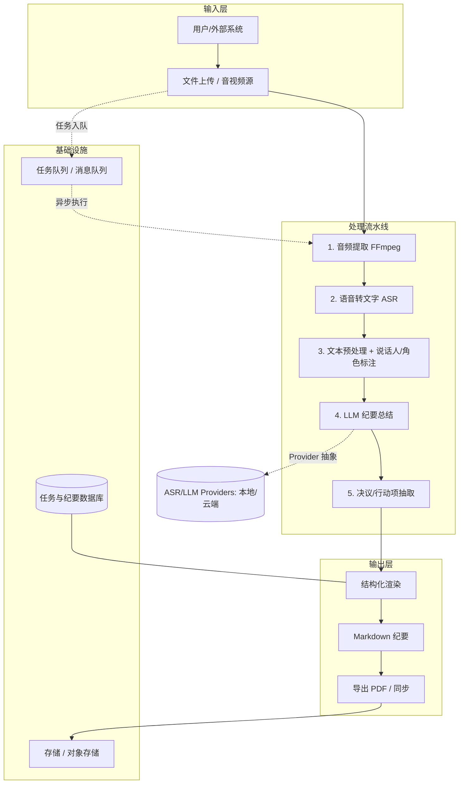
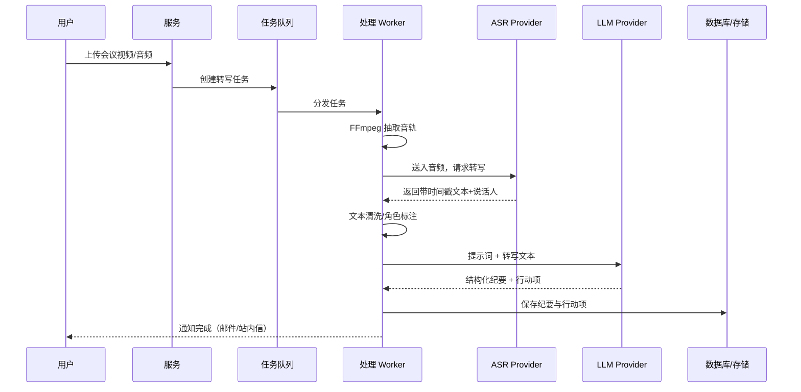

# 总体架构 (Architecture)

| 文档类型 | 总体架构 |
| --- | --- |
| 版本 / 状态 | v0.1（草案）🏗️ |
| 关联文档 | [tech-stack](tech-stack.md) · [technical-solution](technical-solution.md) · [data-model](data-model.md) |

## 1. 架构视图

项目采用 **"管道式 (Pipeline) + 可插拔 Provider"** 架构：一条清晰的处理流水线，ASR 与 LLM 通过抽象接口接入，可自由切换本地 / 云端实现，最大化灵活性与成本可控性。

## 2. 系统数据流（核心链路时序）

## 3. 模块划分与职责

| 模块 | 职责 | 关键技术 🔶建议 |
| --- | --- | --- |
| **ingestion** | 文件上传、格式校验、任务创建 | HTTP / S3 / 对象存储 |
| **audio** | 视频抽音轨、采样率/声道归一化、静音检测 | FFmpeg / pydub |
| **asr** | 语音转文本、说话人分离、时间戳 | Whisper / FunASR / 云API |
| **nlp** | 文本清洗、分段、角色识别、关键词 | spaCy / 规则 + LLM |
| **summary** | LLM 纪要生成、模板化 | DeepSeek / GPT / Qwen |
| **extractor** | 决议/行动项/负责人/截止时间抽取 | LLM Function-Call / JSON Schema |
| **render** | 纪要渲染为 Markdown / PDF | Markdown / Pandoc |
| **orchestrator** | 任务状态机、队列调度、重试 | Celery / 消息队列 |
| **storage** | 原始文件、中间产物、纪要持久化 | 对象存储 + 关系库 |

## 4. 部署形态

🔶【建议】提供两种部署形态，前期以 **云端服务** 为主：

- **云端 SaaS**：API 网关 + 异步任务队列 + 可横向扩展的 Worker 集群，ASR/LLM 走云 API，成本按量。
- **私有化 / 本地**：面向保密需求，ASR/LLM 走开源模型（本地 GPU），数据不出域。

---

> 📌 **下一步**：各模块具体处理逻辑见 [technical-solution.md](technical-solution.md)；持久化结构见 [data-model.md](data-model.md)。
