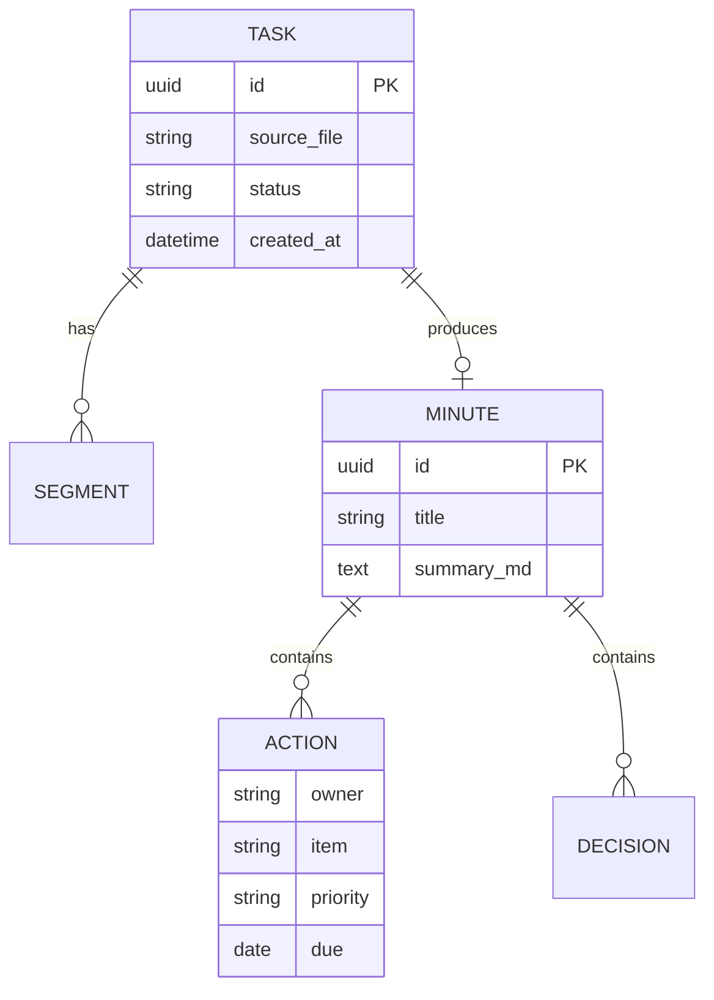

# 数据与接口设计 (Data & Interface Design)

| 文档类型 | 数据与接口设计 |
| --- | --- |
| 版本 / 状态 | v0.1（草案）🏗️ |
| 关联文档 | [architecture](architecture.md) · [requirements](requirements.md) |

## 1. 核心数据模型

### 1.1 Task（转写任务）

| 字段 | 类型 | 说明 |
| --- | --- | --- |
| id | uuid | 任务ID |
| source_file | string | 原始文件路径 |
| status | enum | pending / running / succeeded / failed |
| progress | float | 进度 0–1 |
| created_at / finished_at | datetime | 时间 |
| error | string | 失败原因 |

### 1.2 Transcript（转写文本）

| 字段 | 类型 | 说明 |
| --- | --- | --- |
| task_id | fk | 关联任务 |
| segments[] | list | 每段：start / end / speaker / text |

### 1.3 Minute（纪要）

| 字段 | 类型 | 说明 |
| --- | --- | --- |
| task_id | fk | 关联任务 |
| title | string | 会议主题 |
| summary_md | text | 纪要 Markdown |
| decisions[] | list | 决议 |
| actions[] | list | 行动项（owner / due / priority） |
| open_questions[] | list | 未决问题 |

## 2. 领域关系（ER 简图）

## 3. API 接口约定（RESTful 建议）

| 方法 | 路径 | 说明 |
| --- | --- | --- |
| POST | `/api/tasks` | 上传文件并创建转写任务 |
| GET | `/api/tasks/{id}` | 查询任务状态与进度 |
| GET | `/api/tasks/{id}/transcript` | 获取转写文本 |
| GET | `/api/tasks/{id}/minute` | 获取生成的纪要 |
| POST | `/api/tasks/{id}/regen` | 重新生成（换模型/模板） |
| GET | `/api/minutes` | 纪要历史列表 / 搜索 |

---

> 📌 **下一步**：如何保证这些设计正确实现，见 [testing.md](testing.md)。
