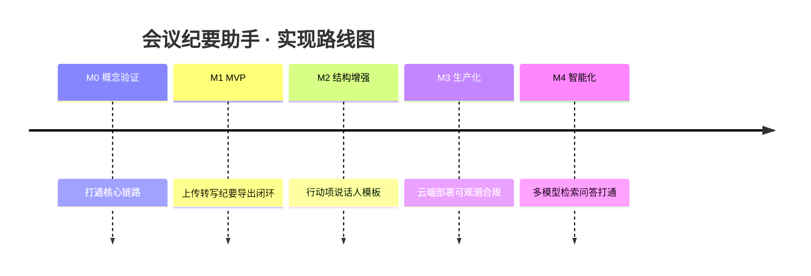

# 实现路线图 (Roadmap)

| 文档类型 | 实现路线图 |
| --- | --- |
| 版本 / 状态 | v0.2（已确认关键决策）✅ |
| 关联文档 | [mission](mission.md) · [tech-stack](tech-stack.md) |

> 本文定义从概念验证到智能化的**分阶段实现计划**。每个阶段统一按四要素展开：
> **🎯 目标 → 🔧 详细实现 → 🛠 实现方法 → 📋 工作顺序 → ✅ 验证成果**。
> 阶段之间有强依赖，必须串行推进（前一阶段的验证成果是后一阶段的输入）。
> 关键决策（云端 SaaS 优先 / 走云 API / 中文为主 / ≤ 5 小时 / 利润 0 性价比优先）见 [mission.md §8](mission.md)。

## 总览

| 阶段 | 周期 | 覆盖需求 | 覆盖目标 | 一句话交付 |
| --- | --- | --- | --- | --- |
| M0 概念验证 | 1–2 周 | 链路验证 | — | 一段录音 → 可用纪要 |
| M1 MVP | 3–4 周 | FR-01~07 | G1, G2, G4 | 可用的完整闭环（云 API） |
| M2 结构增强 | 3–4 周 | FR-08~11 | G3 | 结构化纪要 + 行动项 |
| M3 生产化 | 4–6 周 | NFR | 全量生产 | 云端稳定可扩缩 |
| M4 智能化 | 后期 | FR-12~14 | G5, G6, G7 | 多模型 + 检索 + 生态打通 |

---

## M0 · 概念验证 (PoC)

### 🎯 目标
用一段真实会议录音跑通「音频 → 转写 → 纪要」最小闭环，用实测数据锁定云 ASR 厂商与 LLM 选型，验证可行性与成本。

### 🔧 详细实现
- 输入一段 **≥ 10 分钟**的真实会议音频（中文为主，英文为术语混用）。
- FFmpeg 抽取并标准化音轨（16kHz 单声道 WAV）。
- 云 ASR（阿里云 / 讯飞 / 腾讯云）转写为带时间戳文本。
- 调用 LLM（DeepSeek / Qwen）输出结构化 Markdown 纪要。

### 🛠 实现方法
- **技术栈**：Python 3.11 + FFmpeg + 云 ASR SDK + openai SDK（兼容 DeepSeek/Qwen 的 OpenAI 兼容接口）。
- **形态**：单脚本 `pipeline.py` 串联，**暂不做服务化**（不建 Web、不建队列）。
- **环境**：`venv` 隔离；ASR 走云 API，无需本地 GPU。

### 📋 工作顺序
1. 环境准备：建 `venv`，安装 `ffmpeg`、云 ASR SDK、`openai`。
2. 准备样例：录制/获取一段真实会议音频（≥10 分钟，中文为主）。
3. 写 `audio.py`：FFmpeg 抽音轨 + 标准化，验证输出 WAV 规格正确、可播放。
4. 写 `asr.py`：接入云 ASR（对比 1–2 家），验证转写文本完整、含时间戳。
5. 写 `summarize.py`：设计提示词 + 结构化输出，验证生成 Markdown 纪要。
6. 写 `pipeline.py`：端到端串联，记录**耗时 / 成本 / 转写字符数**。
7. 评估：人工评分纪要质量，输出《选型决策记录》。

### ✅ 验证成果
**可交付物**：`pipeline.py` + 一份样例会议的标准 Markdown 纪要 + 《选型决策记录》。

**验收标准**：
- 能对 ≥ 10 分钟音频输出**可读、结构完整**的 Markdown 纪要。
- 产出三组实测数据：转写 CER、单场耗时、单场成本。
- 明确结论：锁定云 ASR 厂商与 LLM 主方案（供 M1 使用）。

**退出条件**：纪要质量达可读水平，耗时/成本落在 mission.md 的 KPI 量级内（≤ 时长 1/3、≤ ¥1/场）。

---

## M1 · MVP（可用闭环 · 云 API）

### 🎯 目标
交付可用的完整闭环（本地开发环境，ASR/LLM 走云 API），满足 FR-01~07，无技术背景用户可自助"上传 → 得到纪要"。

### 🔧 详细实现
- **文件上传**：支持视频/音频（MP4 / MKV / WAV / MP3 / M4A），格式与大小校验（单场 ≤ 5 小时）。
- **任务管理**：创建任务、状态机（pending / running / succeeded / failed）、进度展示（转写阶段按切片推进「第 x/N 段已完成」）。
- **全链路自动化**：上传后自动 音频提取 → 转写 → 纪要生成 → 导出。
- **输出**：Markdown 纪要下载；进度与运行日志可见。

### 🛠 实现方法
- **后端**：FastAPI（异步、类型友好）。
- **任务队列**：MVP 先用轻量方案（FastAPI BackgroundTasks 或单机 Celery+Redis），M3 再上生产级。
- **存储**：本地文件系统 + SQLite（MVP 足够），后续迁移 PostgreSQL + 对象存储。
- **前端**：极简 HTML/JS 上传页 + 进度条（先跑通，不追求美观）。
- **复用 M0**：把 `pipeline.py` 重构为可复用模块 `ingestion / audio / asr / summary / render`。

### 📋 工作顺序
1. 项目骨架：目录结构、配置管理、依赖锁定。
2. 模块化重构：拆出 audio / asr / summary / render 四模块，去掉 M0 脚本式写法。
3. 实现上传接口 + 格式白名单 / 大小 / 时长校验。
4. 实现 Task 数据模型（SQLite）与状态机。
5. 接入任务队列，异步执行全链路。
6. 实现 Markdown 导出与下载接口。
7. 极简前端：上传页 + 进度展示 + 结果下载。
8. 错误处理、重试、结构化日志。

### ✅ 验证成果
**可交付物**：可本地运行的服务（Docker Compose 一键启动，ASR/LLM 走云 API）。

**验收标准**：
- 无技术背景用户可自助完成"上传 → 得到纪要"。
- FR-01~07 全部实现并通过测试。
- 单元测试覆盖率 ≥ 70%。

**退出条件**：端到端流程稳定运行，核心功能无阻断性 Bug。

---

## M2 · 结构增强（纪要质量）

### 🎯 目标
提升纪要质量与可用性，满足 FR-08~11：结构化行动项、说话人角色、多模板、可编辑。

### 🔧 详细实现
- **行动项抽取**：决议 / 行动项 / 负责人 / 截止时间结构化（Function-Calling）。
- **说话人角色标注**：主持人 / 汇报人 / 参会者。
- **纪要模板**：标准 / 精简 / 详细三种。
- **编辑与检索**：纪要人工编辑、批注；历史按时间/主题/关键词检索。

### 🛠 实现方法
- **结构化输出**：定义 `ActionItem` / `Decision` 的 JSON Schema，用 Function-Calling 约束 LLM。
- **说话人分离**：接入云 ASR 的说话人分离能力（或 pyannote / whisperx 兜底），转写文本带 speaker 标注。
- **角色识别**：规则 + LLM 辅助判断角色。
- **模板引擎**：Jinja2 渲染多种模板。
- **前端**：纪要编辑页（可改可批注）+ 历史列表与搜索。

### 📋 工作顺序
1. 定义结构化 Schema：ActionItem / Decision / OpenQuestion 字段。
2. 实现 `extractor` 模块（行动项抽取）+ 评测。
3. 接入说话人分离，转写文本带 speaker 标注。
4. 实现角色识别（规则 + LLM 辅助）。
5. Jinja2 模板化渲染（三套模板）。
6. 编辑 / 批注接口 + 前端。
7. 历史检索（按时间 / 主题 / 关键词）。
8. 建 Eval 集，跑质量评测，回填准确率数据。

### ✅ 验证成果
**可交付物**：结构化纪要（决议 + 行动项清单）、三种模板、可编辑、可检索。

**验收标准**：
- 行动项三要素（决议 / 负责人 / 截止）完整率 ≥ 85%。
- 说话人区分主观正确率 ≥ 80%。
- 支持人工编辑、批注并持久化。

**退出条件**：Eval 集指标达到 mission.md KPI（行动项 ≥ 85%、返工率 ≤ 20%）。

---

## M3 · 生产化（稳定可扩展）

### 🎯 目标
满足全部非功能需求，可对外提供稳定、合规、可观测的云端 SaaS 服务。

### 🔧 详细实现
- **云端部署**：API + 队列 + Worker 可横向扩缩。
- **可观测**：结构化日志、指标、告警。
- **安全合规**：加密存储、鉴权、审计、越权防护。
- **成本监控**：按场/按量成本统计与限额告警。

### 🛠 实现方法
- **容器化**：Docker + Kubernetes（或云托管）。
- **队列**：Celery + Redis / 消息队列（生产级）。
- **存储迁移**：SQLite → PostgreSQL；本地文件 → S3 兼容对象存储。
- **可观测**：Prometheus + Grafana / 云监控。
- **CI/CD**：GitHub Actions（lint → test → build → deploy）。
- **鉴权**：JWT / OAuth；数据 AES-256 加密。

### 📋 工作顺序
1. Docker 化全部服务 + Compose 编排。
2. 搭 CI/CD 流水线（lint / test / build）。
3. 生产存储迁移（PostgreSQL + 对象存储）。
4. 接入可观测（日志 / 指标 / 告警）。
5. 安全加固（鉴权、加密、越权防护、上传校验、模型注入防护）。
6. 性能测试（大文件 / 长会议 / 并发）。
7. 成本监控与限额告警。
8. 灰度上线 + 监控观察。

### ✅ 验证成果
**可交付物**：云端可扩缩部署 + 监控面板 + 灰度上线。

**验收标准**：
- 在线率 ≥ 99%（云端模式）。
- 转写吞吐 ≥ 实时 5 倍。
- 通过 OWASP 安全检查。
- 指标 / 告警可用，成本可见可控。

**退出条件**：生产环境稳定运行，无 P0/P1 事故。

---

## M4 · 智能化（生态打通）

### 🎯 目标
实现多模型切换、历史检索问答、生态打通与实时转写（FR-12~14，G5~G7）。

> 📌 范围收窄（用户 2026-08-27 确认）：M4 聚焦「多模型切换 + 检索问答 RAG」两项；G6（生态打通/IM 同步）与 G7（实时转写）按 mission §8-6/§3 留后期。

### 🔧 详细实现
- **多模型切换**：ASR / LLM Provider 可插拔，配置化切换。
- **检索问答 (RAG)**：会议历史向量化，支持"上次会议谁负责 X"式提问。
- **生态打通**：行动项同步到飞书 / 钉钉 / 企业微信 / 待办（🕐 暂不需要，后期再看）。
- **实时转写**：会议进行中即转即出（流式 ASR）。

### 🛠 实现方法
- **Provider 抽象**：统一接口 + 配置化选择（本地/云端、开源/商业）。
- **向量检索**：pgvector / Milvus + embedding。
- **第三方集成**：飞书 / 钉钉开放平台 API。
- **流式 ASR**：FunASR 流式 / 云实时转写接口。

### 📋 工作顺序
1. Provider 抽象重构，支持配置切换模型。
2. 历史纪要向量化，接入检索问答。
3. 行动项同步到 IM / 待办（飞书 / 钉钉优先，后期启动）。
4. 实时转写实验与接入。
5. 多模型灰度验证，输出对比报告。

### ✅ 验证成果
**可交付物**：多模型可热切换 + 检索问答 + 行动项自动同步 + 实时转写。

**验收标准**：
- 多模型可配置热切换（无需改代码）。
- 检索问答命中率达标（以 Eval 集衡量）。
- 行动项同步到 IM / 待办成功、可追溯。
- 实时转写延迟可接受（秒级）。

**退出条件**：四项能力均上线并通过验证，形成持续迭代机制。

---

> 📌 **当前进度**：M0/M1/M2 已完成；M3 生产化代码与交付物已落地，TG-7 灰度上线待云服务器就绪；**M4 · 智能化** 已落地「多模型切换 + 检索问答 RAG」两项（模型注册表热切换 v4-pro/v4-flash/qwen-plus、pgvector + 云 embedding 纪要自动向量化、`POST /api/qa` 带来源引用 + 越权隔离 + 降级、`POST /api/tasks/{id}/regen` 换模型重生成、RAG Eval 集 + `compare_models.py` 灰度对比）。G6（IM/待办同步）/ G7（实时转写）留后期。下一步：云服务器就绪后完成 M3 上线收口与 M4 云端实测（bge-m3 向量命中率 / 三模型对比云端跑批）。另已完成需求变更「账号注册管控」：禁止自助注册，仅管理员或数据库直接新增用户（详见下条变更记录）。
>
> 🔄 变更（2026-08-25）：LLM 主方案由 DeepSeek-V3 升级为 DeepSeek-V4 Pro（deepseek-v4-pro）；转写阶段新增按切片推进的进度展示（「第 x/N 段已完成」）；M2 落地结构化抽取（Function-Calling + 规则兜底）、说话人分离（腾讯云 SpeakerDiarization + pyannote/占位兜底）、角色识别（规则 + LLM 辅助）、Jinja2 三模板、编辑批注与历史检索、Eval 评测集与脚本。
>
> 🔄 变更（2026-08-26）：M3 生产化落地——服务拆分（api/worker 独立容器 + Celery+Redis 队列）、生产存储（SQLAlchemy 双模式 + MinIO 对象存储 + 迁移脚本）、自建账号体系（注册/登录 + JWT + user_id 越权隔离）、上传魔数校验与提示词注入缓解、AES-256 加密、审计日志、Prometheus+Grafana 可观测与告警、成本监控与限额告警（cost_stats）、GitHub Actions CI/CD、Locust 压测脚本、Caddy TLS 与回滚/观察方案。
>
> 🔄 变更（2026-08-27）：M2 角色识别/话者分离修复 + 腾讯云 COS 接入——修复腾讯 SpeakerDiarization 的 `SpeakerId=0` 被 `or ""` 误丢（话者分离覆盖率 5%→100%）、空 speaker 归假「S1」抢主持人、标准/精简模板缺「说话人/角色」节；新增 ASR URL 识别（SourceType=0，音频上传 COS 整段提交→全局话者分离，实测话者人数 4→2 且转写快 17 倍），对象存储接入腾讯云 COS（S3 兼容 + virtual 寻址 + put_object）；角色识别不再强推「汇报人」（仅命中汇报句式才判，否则参会者）。
>
> 🔄 变更（2026-08-27，M4）：智能化落地——`llm_registry` 模型注册表（`MMA_LLM_ALIAS` 配置化热切换，去 summary/extractor 类内硬编码）、接入 deepseek-v4-flash 降本通道与 Qwen Function-Calling 抽取、`POST /api/tasks/{id}/regen` 换模型/模板重生成、pgvector（compose 换 `pgvector/pgvector:pg16`）+ `minute_embeddings` 表 + `EmbeddingProvider`（OpenAI 兼容云 embedding）+ 纪要自动向量化（失败不阻断）、`POST /api/qa` 检索问答（余弦 top-k + 来源引用 + user_id 越权隔离 + 关键词降级兜底）+ 前端问答入口、`compare_models.py` 多模型对比与 `eval_rag.py` / `eval/rag_eval.json` RAG Eval 集。范围聚焦「多模型切换 + RAG」两项，G6/G7 留后期。
>
> 🔄 变更（2026-08-28，需求变更·账号注册管控）：落地「禁止自助注册，仅管理员/数据库加用户」——关闭公开注册接口 `POST /api/auth/register`（前端删除 `register.html`、登录页去注册入口），新增受管理员 JWT 保护的创建用户接口 `POST /api/admin/users`；`users` 表新增 `is_admin` 标记（默认 False）+ `_MISSING_COLUMNS` 迁移；首位管理员由环境变量 `MMA_ADMIN_USERNAME`/`MMA_ADMIN_PASSWORD` 启动时确保存在（bcrypt 哈希，幂等）；`require_admin` 依赖（未登录 401 / 非管理员 403 / 鉴权关闭放行）+ `admin_create_user` 审计留痕；数据库加用户走 CLI `python -m app.cli create-user`（附使用文档）。范围最小集（暂不做禁用/删除/重置密码/列用户）。
>
> 🔄 变更（2026-08-28，需求变更·上传进度实时反馈）：落地「上传阶段实时进度」——`static/auth.js` 新增 `uploadFile`（XHR 上传 + `upload.onprogress` 字节进度 + Bearer 鉴权 / 401 登出 / onerror / onabort），`static/index.html` `upload()` 改走 XHR 并 100ms 节流展示「已上传 xx%（速度，剩余时间）」，上传完成衔接「排队处理中」、失败 / 中断明确提示；纯前端改造、后端零改动。
>
> 🔄 变更（2026-08-29，纪要质量修正）：定位并修复纪要质量低的根因——① 删除 Map-Reduce 分块（`app/summary.py`/根 `summarize.py` 的 `_chunk_text`/`MAP_PROMPT`/`REDUCE_PROMPT`/`max_chars`），纪要改**全文单次调用**（deepseek-v4-pro 1M 上下文，5h 会议无需分块）；② 修复 extractor 硬截断 `text[:max_chars]`（1h 会议只看到前 62% 导致决议/行动项偏少），改恒全量抽取；③ 删除 `LLM_MAX_CHARS`/`MMA_LLM_MAX_CHARS` 配置；④ 上传时长上限 2h→5h（`MMA_MAX_DURATION_SECONDS=18000`，同步 mission §5/§6/§7/§8-4 与 tech-stack A6/B3）。A/B 实测：生产 19218 字会议决议 1→7、行动项 2→6、未决问题 2→3，总耗时 305s→199.5s。
