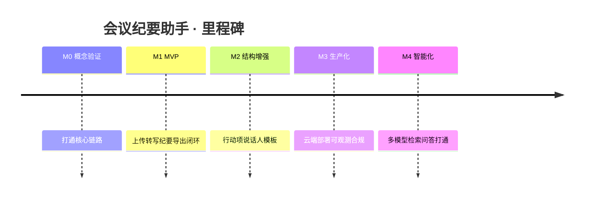

# 路线图与里程碑 (Roadmap)

| 文档类型 | 路线图与里程碑 |
| --- | --- |
| 版本 / 状态 | v0.1（草案）🏗️ |
| 关联文档 | [mission](mission.md) · [tech-stack](tech-stack.md) · [architecture](architecture.md) |

## 里程碑总览

## 阶段明细

### M0 概念验证 (PoC) —— 1–2 周

**目标**：用一份真实会议录音，跑通最小可运行闭环，验证准确率与成本。

**交付物**

- FFmpeg 抽取音轨脚本。
- Whisper（或等价 ASR）转写示例。
- 一次 LLM 结构化纪要生成。
- 可行性结论：准确率 / 成本 / 耗时数据。

**退出标准**：能对 1 段 ≥10 分钟的真实会议音频输出可用的 Markdown 纪要。

### M1 MVP —— 3–4 周

**目标**：单机可用的完整闭环，满足核心需求 FR-01~07。

**交付物**

- 文件上传（视频/音频）。
- 转写任务与进度展示。
- 纪要生成与 Markdown 导出。
- 基础错误处理与重试。

**退出标准**：无技术背景用户能自助完成"上传 → 得到纪要"。

### M2 结构增强 —— 3–4 周

**目标**：提升纪要质量与可用性，满足 FR-08~11。

**交付物**

- 行动项/决议/负责人/截止时间抽取（结构化）。
- 说话人角色标注（主持人/汇报人/参会者）。
- 多种纪要模板（标准/精简/详细）。
- 纪要编辑与批注、历史检索。

### M3 生产化 —— 4–6 周

**目标**：满足非功能需求，可对外提供服务。

**交付物**

- 云端部署（API + 队列 + Worker 可扩缩）。
- 可观测（结构化日志、指标、告警）。
- 安全与合规（加密、鉴权、审计）。
- 成本监控与限额告警。

### M4 智能化 —— 后期

**交付物**

- 多模型切换（ASR / LLM Provider 可插拔）。
- 会议历史检索与智能问答。
- 日历 / 待办 / IM 打通（飞书 / 钉钉 / 企业微信）。
- 实时转写（边开边转）。

## 里程碑 × 需求映射

| 里程碑 | 覆盖需求 | 覆盖目标 |
| --- | --- | --- |
| M0 | 链路验证 | — |
| M1 | FR-01~07 | G1, G2, G4 |
| M2 | FR-08~11 | G3 |
| M3 | NFR | 全量生产 |
| M4 | FR-12~14 | G5, G6, G7 |

## 里程碑 × 技术选型依赖

| 里程碑 | 依赖的技术决策（见 tech-stack.md） |
| --- | --- |
| M0 | ASR 初选（Whisper / 云 API）、LLM 初选 |
| M1 | 后端框架、任务队列、存储方案 |
| M2 | 结构化输出方案（Function-Calling）、模板引擎 |
| M3 | 容器编排、CI/CD、可观测栈 |
| M4 | Provider 抽象、向量检索 |

---

> 📌 **下一步**：各里程碑的技术选型详见 [tech-stack.md](tech-stack.md)。
