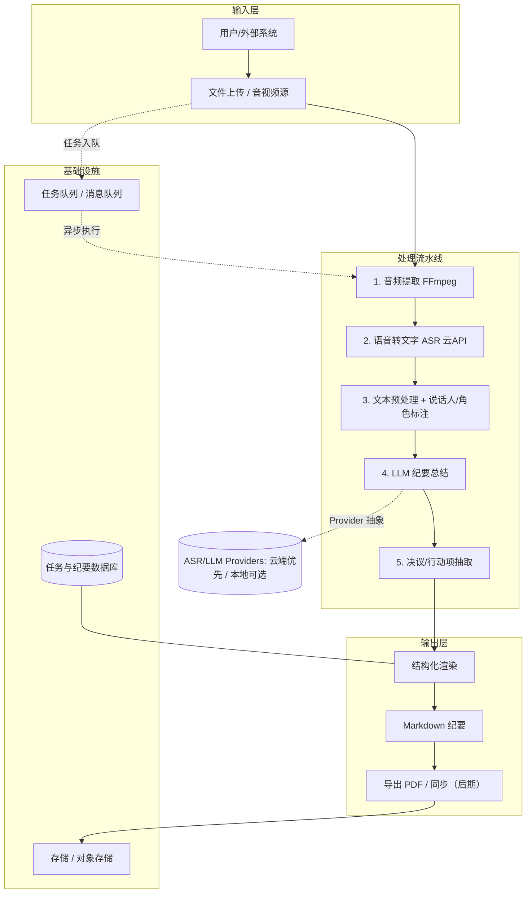

# 技术栈与技术设计 (Tech Stack & Design)

| 文档类型 | 技术栈与技术设计 |
| --- | --- |
| 版本 / 状态 | v0.8（M3 生产化已落地：Celery+Redis 队列 / PostgreSQL+MinIO 存储 / 自建账号+JWT / Prometheus+Grafana 可观测 / CI/CD / 成本监控 / 灰度上线准备）✅ |
| 关联文档 | [mission](mission.md) · [roadmap](roadmap.md) · [选型决策记录](decisions/选型决策记录.md) |

> 说明：本文汇总技术选型（Part A）与技术设计（Part B：需求、架构、方案、数据、测试、部署）。标记 🔶【建议】为倾向方案，✅【已定】为已决项。关键决策（云端 SaaS 优先 / 走云 API / 中文为主 / ≤ 2 小时 / 利润 0 性价比优先）见 [mission.md §8](mission.md)，具体厂商已由 M0 实测锁定，见 [decisions/选型决策记录.md](decisions/选型决策记录.md)。

---

## Part A · 技术栈选型

### A1. 编程语言与运行时

| 层 | 选型 🔶建议 | 说明 |
| --- | --- | --- |
| 后端 / 服务 | **Python 3.11+** | AI 生态最全（ASR/LLM/NLP 库丰富） |
| Web / 服务 | **Python（FastAPI）** ✅ | M1 已落地（异步 API + 极简前端） |
| 脚本 / 工具 | Bash / Python | FFmpeg 封装、批处理 |

### A2. 核心处理链路选型

#### 音频处理（视频抽音轨 / 预处理）

| 方案 | 说明 | 建议 |
| --- | --- | --- |
| **FFmpeg** ✅ | 视频抽音轨、采样率/声道归一化、静音检测 | 已定（业界标准） |
| pydub / librosa | Python 侧音频处理封装 | 🔶 轻量处理时使用 |

#### 语音转文字 (ASR)

| 方案 | 类型 | 优点 | 缺点 | 适用 |
| --- | --- | --- | --- | --- |
| **腾讯云 16k_zh** | 云API | 中英术语混用最稳、标点好、批量录音文件识别、长音频友好 | 按量收费、数据出域 | ✅ **已锁定（M0 实测）** |
| 阿里云 NLS | 云API | 实时接口快、质量相当；长音频需 OSS 承载 URL | 按量收费、数据出域 | 🔶 备选（M0 实测） |
| Azure / Google / OpenAI whisper-api | 云API | 多语言、省心 | 外资云、成本、合规 | 对标外企 / 多语场景 |
| **faster-whisper（本地兜底）** | 开源 | 免费、离线、数据不出域 | 无标点、易输出繁体、漏识别多（M0 实测 base） | 私有化 / 离线兜底（后期降本） |
| **FunASR（阿里开源）** | 开源 | 中文口语极佳、带说话人分离 | 生态较小 | 后期本地化 / 实时转写 |

#### 说话人分离 (Diarization)

| 方案 | 说明 | 建议 |
| --- | --- | --- |
| 云 ASR 内置说话人分离 | 腾讯云录音文件识别 `SpeakerDiarization`（结果含 `SpeakerId`） | ✅ **已落地（M2）** |
| **pyannote-audio** | 业界主流开源说话人分离 | 🔶 兜底（M2 已抽象 `DiarizationProvider`，可选接入，需 HF token） |
| **whisperX（di-art）** | 对齐 whisper 时间戳 + 说话人 | 🔶 备选 |
| **占位话者（S1/S2…）** | speaker 缺失时按轮次标记占位 | ✅ 已落地（M2 兜底，保证链路可跑通） |

#### 文本预处理与角色标注

| 方案 | 说明 |
| --- | --- |
| 规则 + 正则 | 分句、去重、合并碎句 |
| LLM 辅助 | 角色识别（主持人/汇报人/参会者）、关键词提取 |
| spaCy / jieba | 中文分词、实体识别（可选） |

#### LLM 纪要生成

| 方案 | 特点 | 建议 |
| --- | --- | --- |
| **DeepSeek-V4 Pro（deepseek-v4-pro）** | 中文强、Agent 能力增强、1M 上下文；性价比高（M0 实测 V3，2026-08-25 升级 V4 Pro；成本与计费见 A6） | ✅ 已锁定 |
| Qwen（通义千问） | 中文好、性价比高 | 🔶 备选（待密钥，未测） |
| GLM / Kimi | 国产、长文本友好 | 候选 |
| GPT-4o / Claude | 通用能力强、成本较高 | 候选（对标外企场景） |

#### 结构化输出与抽取

| 方案 | 说明 |
| --- | --- |
| **Function-Calling / JSON Schema** ✅ | 约束 LLM 输出为稳定结构 |
| response_format（JSON mode） | 备选，兼容性依供应商而定 |

#### 渲染与导出

| 方案 | 说明 |
| --- | --- |
| Markdown（原生）✅ | 纪要主格式（首期交付） |
| Jinja2 模板 ✅ | 模板化渲染（M2 已落地三套模板：标准 / 精简 / 详细） |
| **Pandoc** | MD → PDF / docx（🕐 后期再看） |

### A3. 基础设施选型

| 模块 | 方案 🔶建议 | 说明 |
| --- | --- | --- |
| Web 框架 | **FastAPI** ✅ | M1 已落地（异步、类型友好） |
| 任务队列 | FastAPI BackgroundTasks（M1）→ **Celery + Redis** ✅ | M3 已落地（API 入队 / worker 消费 / 状态回写；本地开发回退 BackgroundTasks） |
| 存储 | 本地文件系统 + SQLite（M1/M2）→ **PostgreSQL + MinIO** ✅ | M3 已落地（SQLAlchemy 双模式 sqlite:///postgresql://，boto3 S3 兼容对象存储 + 本地 FS 兜底；预留平滑迁移腾讯云 COS） |
| 容器化 | **Docker / Docker Compose** ✅ | M3 已落地多服务编排（api / worker / redis / postgres / minio / prometheus / grafana） |
| 编排（云端） | Kubernetes | Worker 可扩缩已通过 `--scale worker=N` 预留（M3 架构预留，K8s 留真实多机需要） |
| 可观测 | 结构化日志（✅ M1）+ **Prometheus + Grafana** ✅ | M3 已落地 `/metrics` + 采集 + 面板 + 告警规则（webhook/邮件） |
| CI/CD | **GitHub Actions** ✅ | M3 已落地（lint → test → build → GHCR 镜像发布） |

### A4. 选型原则

1. **可插拔 (Provider 抽象)**：ASR 与 LLM 均通过统一接口接入，可随时切换本地/云端、开源/商业。
2. **成本可控（利润 0 优先性价比）**：优先性价比高的云端 API（按量计费），开源离线方案作为后期降本选项。
3. **中文优先**：所有模型选型以中文（普通话）效果为第一判据，英文作为术语/关键词混用处理。
4. **数据出域可接受**：首期走云 API，本地化部署留作后期合规选项。
5. **先验证后锁定**：M0 用实测准确率/成本/耗时数据锁定具体厂商，不做纸上选型。

### A5. 已锁定厂商（M0 实测）

> M0 实测结论详见 [decisions/选型决策记录.md](decisions/选型决策记录.md)，本节为锁定结果摘要。

| 决策点 | 已定方向 | 锁定结论 |
| --- | --- | --- |
| ASR 主方案 | ✅ 云 API（接受数据出域） | ✅ **腾讯云 16k_zh**（中英混用最优、批量录音文件识别）；备选阿里云 NLS；本地兜底 faster-whisper |
| LLM 主方案 | ✅ 性价比高（利润 0） | ✅ **DeepSeek-V4 Pro（deepseek-v4-pro）**（纪要质量更优，由 V3 升级）；备选 Qwen（待密钥）；计费与单场成本估算见 A6 |
| 部署形态 | ✅ 云端 SaaS 优先 | ✅ **腾讯云服务器 + Docker Compose 单机多服务**（M3 已落地：Worker 独立容器可 `--scale` 扩缩、存储外置；K8s 留真实多机需要） |

### A6. 成本模型与计费参考（DeepSeek LLM）

> 数据来源：[DeepSeek 官方计费页](https://api-docs.deepseek.com/zh-cn/quick_start/pricing/)（2026-08-25 读取；产品价格可能变动，以官方页为准）。本小节支撑 mission §6 KPI「成本 ≤ ¥1/场」与 §8-5「利润 0 性价比优先」。

**① 当前价格表（单位：元 / 百万 tokens）**

| 模型 | 输入（缓存命中） | 输入（缓存未命中） | 输出 | 并发限制 |
| --- | --- | --- | --- | --- |
| **deepseek-v4-pro**（已锁定） | 空闲 0.15 / 高峰 0.30 | 空闲 4.5 / 高峰 9.0 | 空闲 13.5 / 高峰 27.0 | 500 |
| **deepseek-v4-flash**（降本备选） | 空闲 0.05 / 高峰 0.10 | 空闲 1.5 / 高峰 3.0 | 空闲 4.5 / 高峰 9.0 | 2500 |
| deepseek-v4-flash-vision-exp | 同 flash | 同 flash | 同 flash | 2500 |

- **高峰时段**：北京时间周一至周五 9:00–12:00、14:00–18:00，其余为空闲时段；**空闲时段价格为高峰的一半**。
- 三模型上下文均为 1M、输出最长 384K；默认开启思考模式（价格表未区分思考/非思考）。
- `deepseek-v4-flash-vision-exp` 为视觉模型（图片按尺寸折算 token 计费），本项目无图像分析需求（mission §3 范围外），仅作记录。

**② 扣费规则**

- 扣减费用 = token 消耗量 × 模型单价，从账户余额直接扣减；充值余额与赠送余额并存时**优先扣减赠送余额**。
- 输入 token 命中「上下文硬盘缓存」时按缓存命中价计费（约为未命中价的 **1/30**），未命中按未命中价。

**③ 单场成本估算（V4 Pro，推算值）**

| 场景 | 输入 token（推算） | 输出 token（推算） | 估算成本 |
| --- | --- | --- | --- |
| 80min 会议（M0 实测 22,632 字） | 3.5 万~13.5 万（Map-Reduce 多轮 ×1.5~3 + 提示词） | 5k~15k（纪要 + 结构化抽取） | ≈ **¥0.2~0.8/场（空闲）** |
| 高峰时段（×2） | 同上 | 同上 | ≈ **¥0.5~1.6/场** |

- 假设：1 汉字 ≈ 1~2 token；Map-Reduce 分块多轮 + 提示词使总输入为单遍的 1.5~3 倍。若分块重复读入触发上下文缓存，输入成本趋近命中价，下限可低至 ¥0.1 量级。
- 对照：M0 实测（V3 时代）80min 会议 LLM 成本 ¥0.0453，与本推算同量级；**正式值待 M3「成本监控与限额告警」落地后重测**。
- 结论：**空闲时段跑批单场可稳在 ¥1 KPI 内**；高峰时段 2h 长会议可能接近/超过 ¥1/场。降本手段：① 空闲时段跑批（半价）；② 切换 **deepseek-v4-flash**（价格约为 Pro 的 1/3、并发上限更高，质量略低，灰度对比后作低成本通道 / M4 多模型切换备选）；③ 利用上下文缓存（Map-Reduce 分块总结天然复用输入）。
- 注：本节仅覆盖 LLM 侧；转写走腾讯云 ASR 按量计费，费用另计。

---

## Part B · 技术设计

### B1. 需求分析

**功能需求（MoSCoW）**

| 编号 | 需求 | 描述 | 优先级 |
| --- | --- | --- | --- |
| FR-01 | 文件上传 | 拖拽/选择会议视频或音频文件 | M |
| FR-02 | 音频提取 | 抽音轨、格式与采样率标准化 | M |
| FR-03 | 语音转写 | 带时间戳文本 + 说话人识别 | M |
| FR-04 | 纪要生成 | 结构化总结（LLM） | M |
| FR-05 | 行动项提取 | 决议/行动项/负责人/截止时间 | M |
| FR-06 | 输出导出 | Markdown 纪要（PDF/docx 后期） | M |
| FR-07 | 任务状态 | 进度与运行日志 | M |
| FR-08 | 纪要模板 | 标准/精简/详细模板 | S |
| FR-09 | 编辑批注 | 人工修改、批注、确认 | S |
| FR-10 | 历史管理 | 按时间/主题检索 | S |
| FR-11 | 角色标注 | 主持人/汇报人/与会者 | S |
| FR-12 | 多模型切换 | 切换 LLM / ASR 模型 | C |
| FR-13 | 摘要播客 | 行动摘要邮件/播客稿 | C |
| FR-14 | 实时转写 | 会议中即转即出 | C |

> M=Must, S=Should, C=Could

**非功能需求（NFR）**

| 维度 | 要求 |
| --- | --- |
| 性能 | 转写吞吐 ≥ 实时 5 倍；纪要生成可并行 |
| 可用性 | 单任务失败可重试；在线率 ≥ 99%（云端） |
| 可扩展 | ASR / LLM 可插拔（Provider 抽象） |
| 安全 | AES-256 加密存储、全程 TLS、鉴权 |
| 隐私合规 | ✅ 首期走云 API（接受数据出域）；本地化部署留作后期选项 |
| 可观测 | 结构化日志 + 指标（耗时/错误率/成本） |
| 可维护 | 模块化、单测覆盖率 ≥ 70% |

### B2. 总体架构

**"管道式 (Pipeline) + 可插拔 Provider"** 架构：



**模块职责**

| 模块 | 职责 | 关键技术 🔶建议 |
| --- | --- | --- |
| **ingestion** | 文件上传、格式校验、任务创建 | HTTP / S3 / 对象存储 |
| **audio** | 视频抽音轨、采样率/声道归一化、静音检测 | FFmpeg / pydub |
| **asr** | 语音转文本、说话人分离、时间戳 | 腾讯云 16k_zh（备选阿里云 NLS） |
| **nlp** | 文本清洗、分段、角色识别、关键词 | spaCy / 规则 + LLM |
| **summary** | LLM 纪要生成、模板化 | DeepSeek-V4 Pro（deepseek-v4-pro）（备选 Qwen） |
| **extractor** | 决议/行动项/负责人/截止时间抽取 | LLM Function-Call / JSON Schema |
| **render** | 纪要渲染为 Markdown | Markdown / Jinja2（Pandoc 后期） |
| **orchestrator** | 任务状态机、队列调度、重试 | FastAPI BackgroundTasks（M1）/ **Celery + Redis**（M3 已落地） |
| **storage** | 原始文件、中间产物、纪要持久化 | 本地 FS + SQLite（M1）/ **PostgreSQL + MinIO**（M3 已落地，boto3 封装，本地 FS 兜底） |
| **auth / security** | 注册/登录、JWT 鉴权、越权防护、上传校验、加密、审计 | bcrypt + PyJWT HS256 + AES-256-GCM + 审计日志（M3 已落地） |
| **metrics / cost** | 指标、成本统计、限额告警 | prometheus-client + cost_stats 表（M3 已落地） |

**部署形态**

- **云端 SaaS（✅ 首期）**：API 网关 + 异步任务队列 + 可扩缩 Worker 集群，ASR/LLM 走云 API。
- **私有化 / 本地（🕐 后期选项）**：ASR/LLM 走开源模型（本地 GPU），数据不出域。

### B3. 关键技术方案（核心链路）

**① 输入**：腾讯会议/Zoom/Teams 录制（MP4/MP4A）、线下录音（WAV/MP3/M4A）、视频链接（后期）。做格式白名单、大小/时长限制（单场 ≤ 2 小时）。

**② 音频提取（FFmpeg）**

```bash
ffmpeg -i input.mp4 -vn -ac 1 -ar 16000 -f wav output.wav
```

统一 16kHz 单声道；可选静音检测、降噪、AGC。

**③ 语音转文字（ASR）**：抽象 `ASRProvider` 接口，首期接 **腾讯云 16k_zh**（备选阿里云 NLS，本地兜底 faster-whisper）；说话人分离优先用云 ASR 内置能力，pyannote / whisperx 作兜底。长音频按切片逐段识别，`transcribe` 支持 `progress_callback(done, total)` 回调，向任务状态推送「第 x/N 段已完成」切片级进度（本地 whisper 按已处理时长回调）。

**④ 文本预处理与角色标注**：分句、去重、合并碎句；标记说话人；猜测角色。

**⑤ LLM 纪要生成**：结构化输出约束 + 长文本 Map-Reduce 分块总结。关键提示词：

```text
你是会议纪要助手。请对下面的会议转写内容生成结构化纪要，包含：
1) 会议主题与基本信息；2) 核心结论/决议；3) 讨论要点摘要；
4) 行动项清单（负责人、事项、优先级、截止时间）；5) 待跟进/未决问题。
输出为 Markdown。
```

**⑥ 纪要交付物**：默认 Markdown，模板结构（会议目标 / 核心决议 / 讨论要点 / 行动项表 / 未决问题 / 时间戳全文附录）；PDF/docx 导出为后期选项。

### B4. 数据与接口设计

**数据模型**

| 实体 | 关键字段 | 状态 |
| --- | --- | --- |
| Task | id, source_file, stored_path, **user_id**, status, progress, progress_message, error, audio_duration_min, transcript_chars, cost_rmb, created_at / started_at / finished_at | ✅ M1 已落地；M3 迁 SQLAlchemy（sqlite/postgresql 双模式）+ `user_id` 越权隔离 |
| Transcript | task_id, segments[]（start/end/text/speaker） | ✅ M2 已落地（`transcript.json` / `.txt`，segment 带 speaker） |
| Minute | task_id, title, summary_md, decisions[], actions[], open_questions[], speakers[] | ✅ M2 已落地（`minutes` 表：title / template / summary_md / structured_json / edited_md；`comments` 表：author / text / quote） |
| User | id, username, password_hash, created_at | ✅ M3 已落地（自建账号，bcrypt 哈希） |
| AuditLog | id, user_id, action, target, ip, created_at | ✅ M3 已落地（登录/任务/编辑/批注留痕） |
| CostStat | id, task_id, user_id, date, llm_tokens_in/out/cache, llm_cost, asr_cost, total_cost | ✅ M3 已落地（按场/按日成本统计，联动限额告警） |

**ER 关系**：`TASK 1—N SEGMENT`；`TASK 1—0..1 MINUTE`；`MINUTE 1—N ACTION / DECISION`。

**RESTful API**

| 方法 | 路径 | 说明 | 状态 |
| --- | --- | --- | --- |
| POST | `/api/tasks` | 上传文件并创建任务（异步执行） | ✅ M1 |
| GET | `/api/tasks` | 任务列表 | ✅ M1 |
| GET | `/api/tasks/{id}` | 查询任务状态与进度 | ✅ M1 |
| GET | `/api/tasks/{id}/transcript` | 获取转写文本 | ✅ M1 |
| GET | `/api/tasks/{id}/minute` | 获取生成的纪要（编辑后返回编辑内容） | ✅ M2 |
| PUT | `/api/tasks/{id}/minute` | 保存人工编辑后的纪要 | ✅ M2 |
| POST | `/api/tasks/{id}/comments` | 新增批注 | ✅ M2 |
| GET | `/api/tasks/{id}/comments` | 批注列表 | ✅ M2 |
| DELETE | `/api/tasks/{id}/comments/{comment_id}` | 删除批注 | ✅ M2 |
| GET | `/api/minutes` | 纪要历史列表 / 搜索（q / from / to / topic） | ✅ M2 |
| GET | `/health` | 健康检查 | ✅ M1 |
| POST | `/api/auth/register` | 注册（自建账号，bcrypt 哈希） | ✅ M3 |
| POST | `/api/auth/login` | 登录（返回 JWT，PyJWT HS256） | ✅ M3 |
| GET | `/api/costs` | 成本统计（按日累计 / 明细 / 限额状态） | ✅ M3 |
| GET | `/metrics` | Prometheus 指标端点 | ✅ M3 |
| POST | `/api/tasks/{id}/regen` | 重新生成（换模型/模板） | 🕐 后期 |

### B5. 测试策略

| 层级 | 重点 | 手段 |
| --- | --- | --- |
| 单元测试 | 纯逻辑、提示词解析、字段校验 | pytest（✅ 覆盖率 M1 78% → M2 82% → M3 81%，含 auth/storage/metrics/cost） |
| 集成测试 | 音频→ASR→LLM 全链路 | 真实样例 + mock provider |
| 评测集 (Eval Set) | 纪要质量、行动项准确率 | 人工标注黄金基准集 |
| 性能测试 | 大文件、长会议、高并发 | **Locust**（M3 已落地 `locustfile.py`，压测以 mock ASR 为主控费） |
| 安全测试 | 鉴权、越权、上传校验、模型注入 | **OWASP 检查项**（M3 已落地：JWT 鉴权 / user_id 越权 / 魔数校验 / 提示词注入缓解 / AES-256 / TLS） |

> 质量底线：每个里程碑切换前跑固定 Eval 集，指标不达标不发版。

### B6. 部署与运维

- **容器化**：Docker Compose 多服务一键编排（✅ M3 已落地：api / worker / redis / postgres / minio / prometheus / grafana）；K8s 云端集群留真实多机需要。
- **CI/CD**：GitHub Actions（lint → test → build → GHCR 镜像发布）—— ✅ M3 已落地（`.github/workflows/ci.yml`）。
- **可观测**：结构化日志（JSON，✅ M1 `JsonFormatter`）+ `/metrics` + Prometheus 采集 + Grafana 面板 + 告警规则（✅ M3）。
- **安全合规**：自建账号 + JWT、user_id 越权隔离、上传魔数校验、提示词注入缓解、AES-256（MinIO SSE + 应用层）+ TLS（Caddy 反代，✅ M3）。
- **成本监控**：按场/按日成本统计（cost_stats）+ 日限额/单场超预算告警，联动 Prometheus（✅ M3）。

---

> 📌 **下一步**：技术如何分阶段落地，见 [roadmap.md](roadmap.md)。
