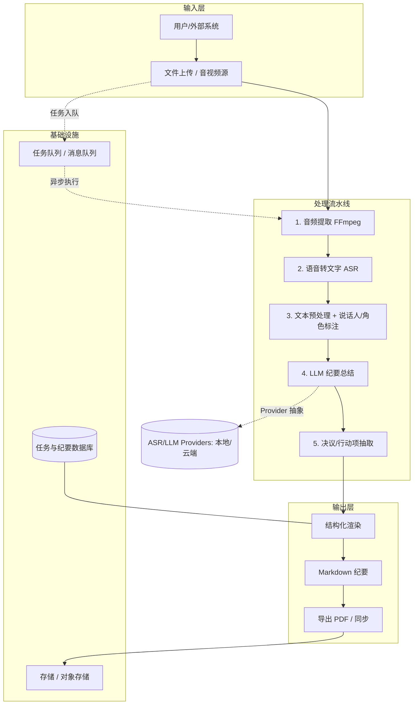

# 技术栈与技术设计 (Tech Stack & Design)

| 文档类型 | 技术栈与技术设计 |
| --- | --- |
| 版本 / 状态 | v0.1（草案）🏗️ |
| 关联文档 | [mission](mission.md) · [roadmap](roadmap.md) |

> 说明：本文汇总技术选型（Part A）与技术设计（Part B：需求、架构、方案、数据、测试、部署）。标记 🔶【建议】为倾向方案，✅【已定】为已决项。最终以 M0 实测数据锁定选型。

---

## Part A · 技术栈选型

### A1. 编程语言与运行时

| 层 | 选型 🔶建议 | 说明 |
| --- | --- | --- |
| 后端 / 服务 | **Python 3.11+** | AI 生态最全（ASR/LLM/NLP 库丰富） |
| Web / CLI | Python（FastAPI）或 TypeScript | 后端为 Python 时优先 FastAPI |
| 脚本 / 工具 | Bash / Python | FFmpeg 封装、批处理 |

### A2. 核心处理链路选型

#### 音频处理（视频抽音轨 / 预处理）

| 方案 | 说明 | 建议 |
| --- | --- | --- |
| **FFmpeg** ✅ | 视频抽音轨、采样率/声道归一化、静音检测 | 已定（业界标准） |
| pydub / librosa | Python 侧音频处理封装 | 🔶 轻量处理时使用 |

#### 语音转文字 (ASR)

| 方案 | 类型 | 优点 | 缺点 | 适用 |
| --- | --- | --- | --- | --- |
| **Whisper / faster-whisper** | 开源 | 中英强、可离线、免费 | 需 GPU / 相对慢 | 🔶本地/私有化首选 |
| **FunASR（阿里开源）** | 开源 | 中文口语极佳、带说话人分离 | 生态较小 | 中文会议候选 |
| 阿里云 / 讯飞 / 腾讯云 ASR | 云API | 准确率高、省心、标点好 | 按量收费、数据出域 | 云端 SaaS |
| Azure / Google / OpenAI whisper-api | 云API | 多语言、省心 | 外资云、成本 | 对标外企 |

#### 说话人分离 (Diarization)

| 方案 | 说明 | 建议 |
| --- | --- | --- |
| **pyannote-audio** | 业界主流说话人分离 | 🔶 首选 |
| **whisperX（di-art）** | 对齐 whisper 时间戳 + 说话人 | 🔶 备选 |

#### 文本预处理与角色标注

| 方案 | 说明 |
| --- | --- |
| 规则 + 正则 | 分句、去重、合并碎句 |
| LLM 辅助 | 角色识别（主持人/汇报人/参会者）、关键词提取 |
| spaCy / jieba | 中文分词、实体识别（可选） |

#### LLM 纪要生成

| 方案 | 特点 | 建议 |
| --- | --- | --- |
| **DeepSeek-V3 / R1** | 中文强、性价比高 | 🔶 首选 |
| Qwen（通义千问） | 中文好、可本地化 | 私有化候选 |
| GLM / Kimi | 国产、长文本友好 | 候选 |
| GPT-4o / Claude | 通用能力强、成本较高 | 候选 |

#### 结构化输出与抽取

| 方案 | 说明 |
| --- | --- |
| **Function-Calling / JSON Schema** ✅ | 约束 LLM 输出为稳定结构 |
| response_format（JSON mode） | 备选，兼容性依供应商而定 |

#### 渲染与导出

| 方案 | 说明 |
| --- | --- |
| Markdown（原生） | 纪要主格式 |
| **Pandoc** | MD → PDF / docx |
| Jinja2 模板 | 模板化渲染 |

### A3. 基础设施选型

| 模块 | 方案 🔶建议 | 说明 |
| --- | --- | --- |
| Web 框架 | **FastAPI** | 异步、类型友好、生态好 |
| 任务队列 | **Celery + Redis** 或 RQ | 异步长任务调度、重试 |
| 存储 | S3 兼容对象存储 + PostgreSQL | 原始文件 + 纪要/任务元数据 |
| 容器化 | **Docker / Docker Compose** | 本地一键起 |
| 编排（云端） | Kubernetes | Worker 可扩缩 |
| 可观测 | 结构化日志 + Prometheus + Grafana | 指标与告警 |
| CI/CD | GitHub Actions | lint → test → build → 镜像发布 |

### A4. 选型原则

1. **可插拔 (Provider 抽象)**：ASR 与 LLM 均通过统一接口接入，可随时切换本地/云端、开源/商业。
2. **成本可控**：优先开源可离线方案，云端按量作为兜底与加速。
3. **中文优先**：所有模型选型以中文（普通话）效果为第一判据。
4. **数据不出域**：为满足隐私合规，默认保留本地化路径。
5. **先验证后锁定**：M0 用实测准确率/成本/耗时数据做最终决策，不做纸上选型。

### A5. 待锁定决策（依赖 M0）

| 决策点 | 候选 | 决策依据 |
| --- | --- | --- |
| ASR 主方案 | Whisper / FunASR / 云API | 中文准确率、成本、数据出域 |
| LLM 主方案 | DeepSeek / Qwen / GPT | 纪要质量、成本、私有化 |
| 部署形态 | 本地 / 云端 | 目标用户与合规要求 |

---

## Part B · 技术设计

### B1. 需求分析

**功能需求（MoSCoW）**

| 编号 | 需求 | 描述 | 优先级 |
| --- | --- | --- | --- |
| FR-01 | 文件上传 | 拖拽/选择会议视频或音频文件 | M |
| FR-02 | 音频提取 | 抽音轨、格式与采样率标准化 | M |
| FR-03 | 语音转写 | 带时间戳文本 + 说话人识别 | M |
| FR-04 | 纪要生成 | 结构化总结（LLM） | M |
| FR-05 | 行动项提取 | 决议/行动项/负责人/截止时间 | M |
| FR-06 | 输出导出 | Markdown 纪要，可导出 PDF | M |
| FR-07 | 任务状态 | 进度与运行日志 | M |
| FR-08 | 纪要模板 | 标准/精简/详细模板 | S |
| FR-09 | 编辑批注 | 人工修改、批注、确认 | S |
| FR-10 | 历史管理 | 按时间/主题检索 | S |
| FR-11 | 角色标注 | 主持人/汇报人/与会者 | S |
| FR-12 | 多模型切换 | 切换 LLM / ASR 模型 | C |
| FR-13 | 摘要播客 | 行动摘要邮件/播客稿 | C |
| FR-14 | 实时转写 | 会议中即转即出 | C |

> M=Must, S=Should, C=Could

**非功能需求（NFR）**

| 维度 | 要求 |
| --- | --- |
| 性能 | 转写吞吐 ≥ 实时 5 倍；纪要生成可并行 |
| 可用性 | 单任务失败可重试；在线率 ≥ 99%（云端） |
| 可扩展 | ASR / LLM 可插拔（Provider 抽象） |
| 安全 | AES-256 加密存储、全程 TLS、鉴权 |
| 隐私合规 | 🔶 默认支持"本地处理、数据不出域" |
| 可观测 | 结构化日志 + 指标（耗时/错误率/成本） |
| 可维护 | 模块化、单测覆盖率 ≥ 70% |

### B2. 总体架构

**"管道式 (Pipeline) + 可插拔 Provider"** 架构：



**模块职责**

| 模块 | 职责 | 关键技术 🔶建议 |
| --- | --- | --- |
| **ingestion** | 文件上传、格式校验、任务创建 | HTTP / S3 / 对象存储 |
| **audio** | 视频抽音轨、采样率/声道归一化、静音检测 | FFmpeg / pydub |
| **asr** | 语音转文本、说话人分离、时间戳 | Whisper / FunASR / 云API |
| **nlp** | 文本清洗、分段、角色识别、关键词 | spaCy / 规则 + LLM |
| **summary** | LLM 纪要生成、模板化 | DeepSeek / GPT / Qwen |
| **extractor** | 决议/行动项/负责人/截止时间抽取 | LLM Function-Call / JSON Schema |
| **render** | 纪要渲染为 Markdown / PDF | Markdown / Pandoc |
| **orchestrator** | 任务状态机、队列调度、重试 | Celery / 消息队列 |
| **storage** | 原始文件、中间产物、纪要持久化 | 对象存储 + 关系库 |

**部署形态**

- **云端 SaaS**：API 网关 + 异步任务队列 + 可扩缩 Worker 集群，ASR/LLM 走云 API。
- **私有化 / 本地**：ASR/LLM 走开源模型（本地 GPU），数据不出域。

### B3. 关键技术方案（核心链路）

**① 输入**：腾讯会议/Zoom/Teams 录制（MP4/MP4A）、线下录音（WAV/MP3/M4A）、视频链接（后期）。做格式白名单、大小/时长限制。

**② 音频提取（FFmpeg）**

```bash
ffmpeg -i input.mp4 -vn -ac 1 -ar 16000 -f wav output.wav
```

统一 16kHz 单声道；可选静音检测、降噪、AGC。

**③ 语音转文字（ASR）**：抽象 `ASRProvider` 接口；说话人分离用 pyannote / whisperx。

**④ 文本预处理与角色标注**：分句、去重、合并碎句；标记说话人；猜测角色。

**⑤ LLM 纪要生成**：结构化输出约束 + 长文本 Map-Reduce 分块总结。关键提示词：

```text
你是会议纪要助手。请对下面的会议转写内容生成结构化纪要，包含：
1) 会议主题与基本信息；2) 核心结论/决议；3) 讨论要点摘要；
4) 行动项清单（负责人、事项、优先级、截止时间）；5) 待跟进/未决问题。
输出为 Markdown。
```

**⑥ 纪要交付物**：默认 Markdown，模板结构（会议目标 / 核心决议 / 讨论要点 / 行动项表 / 未决问题 / 时间戳全文附录）；可导出 PDF/docx。

### B4. 数据与接口设计

**数据模型**

| 实体 | 关键字段 |
| --- | --- |
| Task | id, source_file, status, progress, created_at, error |
| Transcript | task_id, segments[]（start/end/speaker/text） |
| Minute | task_id, title, summary_md, decisions[], actions[], open_questions[] |

**ER 关系**：`TASK 1—N SEGMENT`；`TASK 1—0..1 MINUTE`；`MINUTE 1—N ACTION / DECISION`。

**RESTful API**

| 方法 | 路径 | 说明 |
| --- | --- | --- |
| POST | `/api/tasks` | 上传文件并创建任务 |
| GET | `/api/tasks/{id}` | 查询任务状态与进度 |
| GET | `/api/tasks/{id}/transcript` | 获取转写文本 |
| GET | `/api/tasks/{id}/minute` | 获取生成的纪要 |
| POST | `/api/tasks/{id}/regen` | 重新生成（换模型/模板） |
| GET | `/api/minutes` | 纪要历史列表 / 搜索 |

### B5. 测试策略

| 层级 | 重点 | 手段 |
| --- | --- | --- |
| 单元测试 | 纯逻辑、提示词解析、字段校验 | pytest / jest |
| 集成测试 | 音频→ASR→LLM 全链路 | 真实样例 + mock provider |
| 评测集 (Eval Set) | 纪要质量、行动项准确率 | 人工标注黄金基准集 |
| 性能测试 | 大文件、长会议、高并发 | Locust / k6 |
| 安全测试 | 鉴权、越权、上传校验、模型注入 | OWASP 检查项 |

> 质量底线：每个里程碑切换前跑固定 Eval 集，指标不达标不发版。

### B6. 部署与运维

- **CI/CD**：GitHub Actions（lint → test → build → 镜像发布）。
- **容器化**：Docker Compose 本地一键起；K8s 云端集群。
- **可观测**：结构化日志（JSON）、指标（转写时长/错误率/成本）、告警。
- **安全合规**：加密存储、TLS、鉴权、本地化部署选项。

---

> 📌 **下一步**：技术如何分阶段落地，见 [roadmap.md](roadmap.md)。
